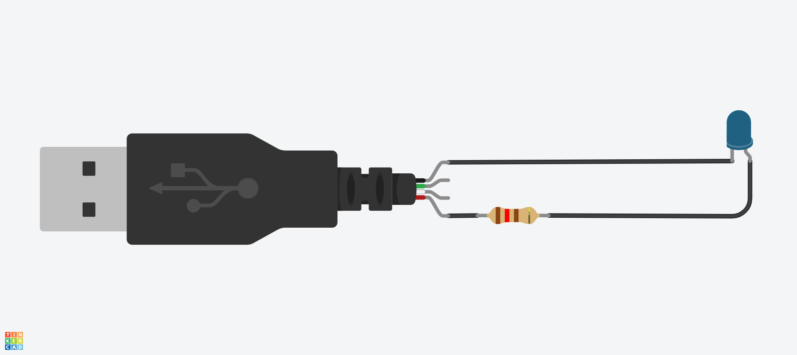
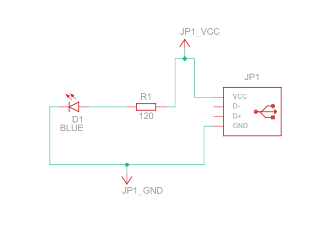
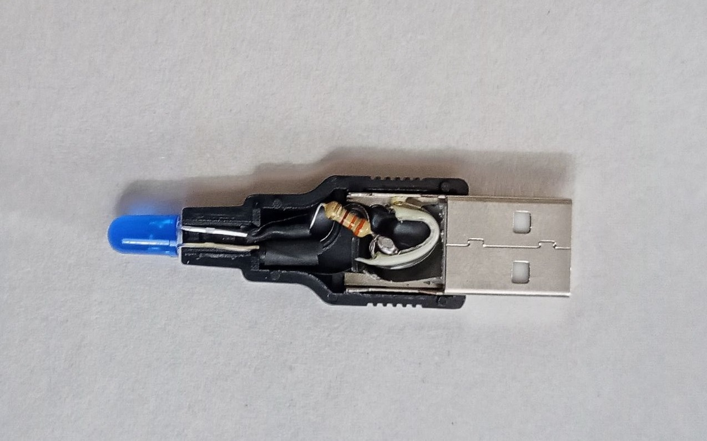
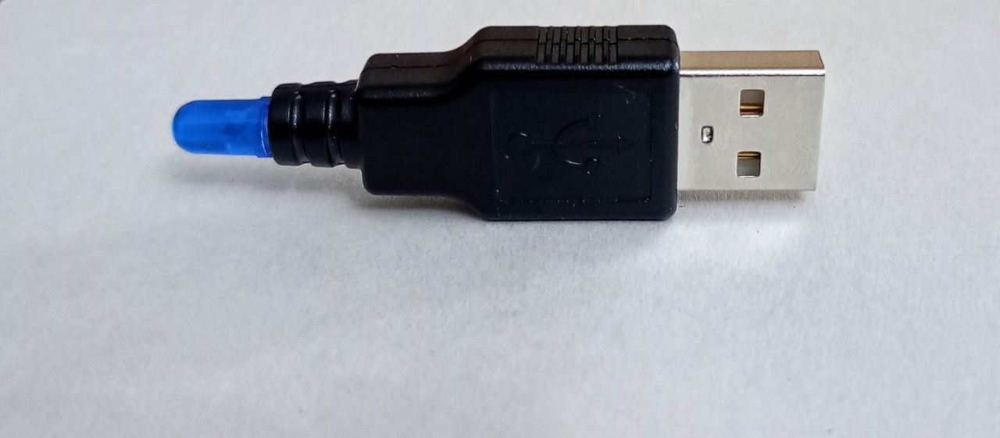

# 💡 DIY USB Lamp

## 📝 Overview

A simple and customizable USB-powered LED lamp project for electronics enthusiasts, students, and makers. This guide walks you through building a USB-powered lamp from scratch using basic electronic components. The lamp runs on the standard 5V supplied by any USB port (e.g., from a computer, power bank, or wall adapter), making it a portable and efficient lighting solution.
Whether you're just getting started with electronics or looking to add a small lighting solution to your workspace, this project provides a rewarding and educational experience with minimal cost and effort.

---

## 🔩 Hardware Components

| Component            | Quantity | Notes                               |
|----------------------|----------|--------------------------------------|
| USB Type-A Male Plug | 1        | Or a USB cable for easier connection |
| LED                  | 1        | Choose based on your color preference|
| Resistor             | 1        | See table below for suggested values |
| Switch               | Optional | For manual control                   |
| Heat Shrink Tubing   | Optional | For insulation and finish            |
| Soldering Kit        | -        | For permanent assembly               |
| Breadboard/Wires     | Optional | For testing before soldering         |

---

## 🔌 Circuit

*Circuit Diagram*

*Circuit Schematic*

### Resistor Value Calculation

To calculate the appropriate resistor value:

$$R = \frac{5 - V_f}{I_f}$$

Where:
- $$V_f$$ = Forward voltage of the LED (depends on color)
- $$I_f$$ = Forward current (typically 5–20mA)

Different LED colors have different forward voltage drops ($$V_f$$). Using Ohm's law, here’s a reference table for choosing resistors:

| LED Color | Approximate Vf (V) | Suggested Resistor (Ω) @15mA  | Acceptable Range (Ω) @5–20mA |
|-----------|--------------------|-------------------------------|------------------------------|
| Red       | 2.0                | 200                           | 150  – 600                   |
| Green     | 2.2                | 180                           | 140  – 560                   |
| Yellow    | 2.2                | 180                           | 140  – 560                   |
| Blue      | 3.2                | 120                           | 90  – 360                    |
| White     | 3.2                | 120                           | 90  – 360                    |

> ℹ️ Use the **next higher standard resistor** if the calculated value is not available (e.g., use 200Ω instead of 197Ω).

### ⚠️ USB Current Limits

- **USB 2.0 port** provides up to **500mA**
- This circuit typically draws **15–20mA**
- You can safely power one LED with plenty of margin

### ✳️ Parallel LEDs

> ℹ️ You can connect multiple LEDs in parallel, but each **must have its own resistor** to ensure proper current limiting.  
> ⚠️ Never connect LEDs directly in parallel without individual resistors, and keep total current below USB limits (<**500 mA**).

---

## 📷 Prototype Snapshot

*Prototype Snapshot 1*

*Prototype Snapshot 2*

---

## 🤝 Contributing

Feel free to fork the project and open pull requests. Bug reports, enhancements, and photos of your builds are welcome!

## References

1. [Circuits on Tinkercad](https://www.tinkercad.com/circuits)

